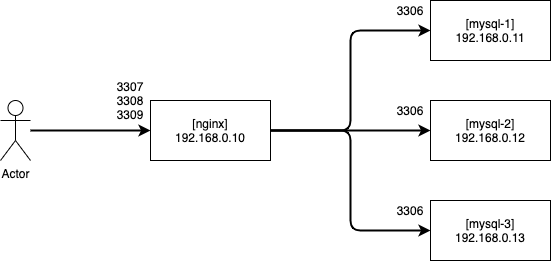

# stream

## 概要

Stream モジュールを使うと、Nginx が任意のポートで TCP の接続を待ち受けるよう設定出来るので TCP ロードバランサを作ることが出来る

[Module ngx_stream_core_module](http://nginx.org/en/docs/stream/ngx_stream_core_module.html)

## サンプル構成

サンプルとして nginx 1 台、 MySQL 3 台の構成の設定

