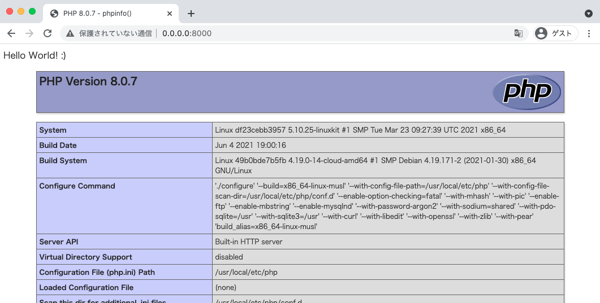

# PHP: Web Sample 01

## 概要

PHP の 1 ファイルを使った、ベーシックなサンプルコード

## Docker コンテナを用いて開発する時

```
cd code-labo/php/web-sample-01
```

+ コンテナの作成

```
docker build . --tag codelabo-php-websample01
```

+ コンテナをデーモン起動

```
docker run \
  -d \
  -p 8000:8080 \
  -v $(pwd):/app \
  --name codelabo-php-websample01 \
  codelabo-php-websample01
```

+ Web ブラウザから確認

http://0.0.0.0:8000



+ [debug] コンテナにログイン ---> :whale:

```
docker exec -it codelabo-php-websample01 /bin/sh
```

+ コンテナの作り直し OR 削除

```
docker stop codelabo-php-websample01 && \
docker rm -f codelabo-php-websample01 && \
docker rmi codelabo-php-websample01
```
