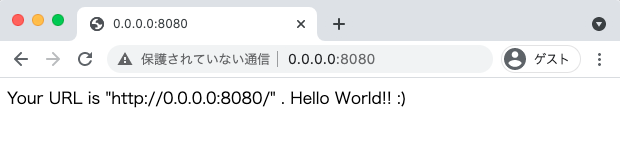
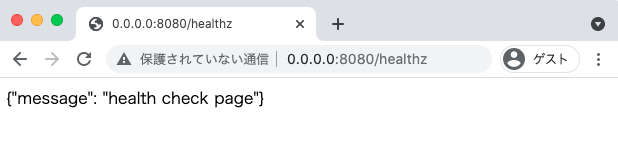

# Python: Web Sample all

## Docker コンテナを用いて開発する時

```
cd python/web-sample-all
```

+ コンテナの作成

```
docker build . --tag codelabo-py-websampleall
```

+ コンテナをデーモン起動

```
docker run \
  -d \
  -p 8080:5000 \
  -v $(pwd):/app \
  --name codelabo-py-websampleall \
  codelabo-py-websampleall
```

## Web ブラウザから確認

http://0.0.0.0:8080



http://0.0.0.0:8080/healthz



http://0.0.0.0:8080/hogehoge


## コマンドラインで確認

cURL を用いて確認する

+ Top ページ

```
curl 0.0.0.0:8080
```
```
### 例

$ curl 0.0.0.0:8080
Your URL is "http://0.0.0.0:8080/" .
```

+ ヘルスチェックページ

```
curl 0.0.0.0:8080/healthz
```
```
### 例

$ curl 0.0.0.0:8080/healthz
{"message": "health check page"}
```

+ 任意の path

```
curl 0.0.0.0:8080/hogehoge
```
```
### 例

$ curl 0.0.0.0:8080/hogehoge
Your URL is "http://0.0.0.0:8080/hogehoge" .
HostName: 9a14d375278c
Host IP: 172.17.0.2
Remote IP Address: 172.17.0.1
Current time: 2023-10-15 20:07:21.053610
Your Env: environ({'PATH': '/usr/local/bin:/usr/local/sbin:/usr/local/bin:/usr/sbin:/usr/bin:/sbin:/bin', 'HOSTNAME': '9a14d375278c', 'LANG': 'C.UTF-8', 'GPG_KEY': 'hogehoge', 'PYTHON_VERSION': '3.11.6', 'PYTHON_PIP_VERSION': '23.2.1', 'PYTHON_SETUPTOOLS_VERSION': '65.5.1', 'PYTHON_GET_PIP_URL': 'https://github.com/pypa/get-pip/raw/9af82b715db434abb94a0a6f3569f43e72157346/public/get-pip.py', 'PYTHON_GET_PIP_SHA256': '45a2bb8bf2bb5eff16fdd00faef6f29731831c7c59bd9fc2bf1f3bed511ff1fe', 'HOME': '/root', 'WERKZEUG_SERVER_FD': '4', 'WERKZEUG_RUN_MAIN': 'true'})
```

## 動かない場合の調査方法

+ コンテナにログイン ---> :whale:

```
docker exec -it codelabo-py-websampleall /bin/bash
```

+ コンテナの作り直し OR 削除

```
docker stop codelabo-py-websampleall && \
docker rm -f codelabo-py-websampleall && \
docker rmi codelabo-py-websampleall
```

## 停止と削除

+ 停止

```
docker stop codelabo-py-websampleall
```

+ 削除

```
docker rm codelabo-py-websampleall
```